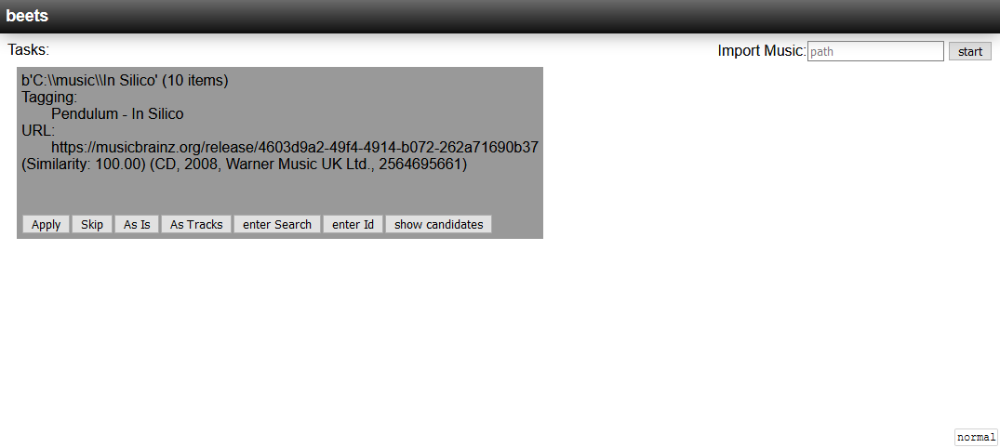

# beets-web-import - This is a work in progress!
An import web interface for beets

## Warning
This does not work with the current release of beets, only with the master!

## Installation

```
pip install beets-web-import
```

To use this plugins, just use the plugins option in your config.yaml file, like so:
```
plugins: webimport
```

## Example screenshot

